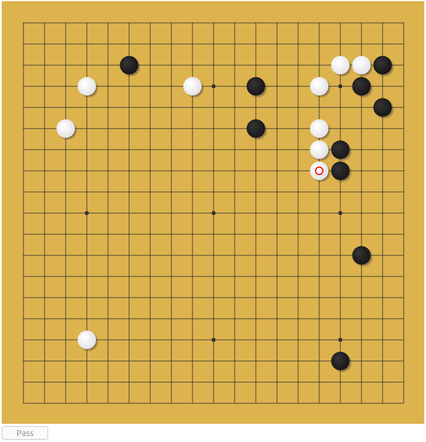

# Rusty Goban

A Go board implemented in Rust and Javascript.

## Overview

This project includes a Go board which is implemented in Rust, build to WebAssembley
and then displayed in the browser using a javascript canvas UI. Online multiplayer
is made possible using socket IO and a node server.

## Playing

The board is deployed at https://goban.cthulahoops.org/. Click "Create Game" and
send the link to the game to a friend. This server is not stable, and may be restarted
and lose game state.



What works:

* Different board sizes
* Captures
* Ko
* Passing

What doesn't work:

* Handicaps
* Game end
* Scoring

## Building

### Build the rust code

```
$ cargo build
$ wasm-pack build -t bundler -d pkg
$ wasm-pack build -t nodejs -d nodepkg
```

### Install and pack and the client code

```
$ cd www
$ npm install
$ npm run build
```

### Run the server

```
$ cd ../server
$ npm install 
$ npm run serve
```

You will find a go board on http://localhost:3000.


## Deployment with Docker

After the building the server, you can create a docker container for the code with:

```
# Return to project root
$ cd ..  
$ docker build -t goban .
$ docker run -ti goban
```

The go board will be available on http://localhost:3000/
